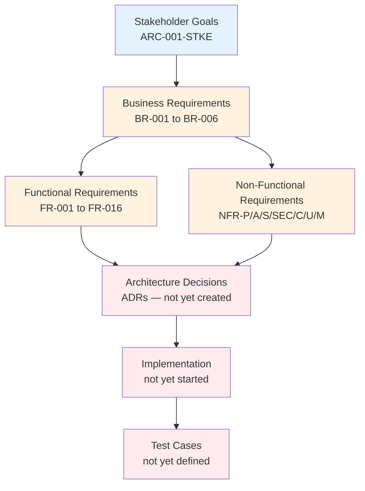

# Requirements Traceability Matrix: DeLimerence

> **Template Origin**: Official | **ArcKit Version**: 4.6.4-rc.1 | **Command**: `/arckit:traceability`

## Document Control

| Field | Value |
|-------|-------|
| **Document ID** | ARC-001-TRAC-v1.0 |
| **Document Type** | Requirements Traceability Matrix |
| **Project** | DeLimerence (Project 001) |
| **Classification** | OFFICIAL |
| **Status** | DRAFT |
| **Version** | 1.0 |
| **Created Date** | 2026-04-06 |
| **Last Modified** | 2026-04-06 |
| **Review Cycle** | Monthly |
| **Next Review Date** | 2026-05-06 |
| **Owner** | Mark Craddock, Product Owner |
| **Reviewed By** | [PENDING] |
| **Approved By** | [PENDING] |
| **Distribution** | Project Team, Architecture Team, Clinical Advisory Board |

## Revision History

| Version | Date | Author | Changes | Approved By | Approval Date |
|---------|------|--------|---------|-------------|---------------|
| 1.0 | 2026-04-06 | ArcKit AI | Initial creation from `/arckit:traceability` command | [PENDING] | [PENDING] |

## Document Purpose

This document provides end-to-end traceability from business requirements through design, implementation, and testing for the DeLimerence project. It establishes a baseline traceability matrix at the pre-design stage, identifying all 50 requirements from ARC-001-REQ-v1.0 and their current coverage status. This matrix will be updated as architectural decisions, designs, and tests are created.

---

## 1. Overview

### 1.1 Purpose

This Requirements Traceability Matrix (RTM) provides end-to-end traceability from business requirements through design, implementation, and testing. It ensures:

- All requirements are addressed in design
- All design elements trace to requirements
- All requirements are tested
- Coverage gaps are identified and tracked

### 1.2 Traceability Scope

This matrix traces:

### 1.3 Document References

| Document | Version | Date | Link |
|----------|---------|------|------|
| Requirements Document | v1.0 | 2026-04-06 | ARC-001-REQ-v1.0.md |
| Stakeholder Analysis | v1.0 | 2026-04-06 | ARC-001-STKE-v1.0.md |
| Risk Register | v1.0 | 2026-04-06 | ARC-001-RISK-v1.0.md |
| Research Findings | v1.0 | 2026-04-06 | research/ARC-001-RSCH-v1.0.md |
| High-Level Design (HLD) | — | — | Not yet created |
| Detailed Design (DLD) | — | — | Not yet created |
| Test Plan | — | — | Not yet created |

---

## 2. Traceability Matrix

### 2.1 Forward Traceability: Business Requirements → Functional Requirements → Design → Tests

#### Business Requirements

| BR ID | Description | Priority | Related FRs | Design Component | Test Cases | Status |
|-------|-------------|----------|-------------|------------------|------------|--------|
| BR-001 | Deliver Limerence Recovery Tool | MUST | FR-001 to FR-009, FR-011, FR-014 | — | — | ⏳ Planned |
| BR-002 | Prevent User Attachment to the Tool | MUST | FR-001, FR-002, FR-006, FR-007, FR-011, FR-013 | — | — | ⏳ Planned |
| BR-003 | Demonstrate Measurable Clinical Outcomes | MUST | FR-004, FR-012, FR-016 | — | — | ⏳ Planned |
| BR-004 | Achieve Regulatory Compliance Before Launch | MUST | FR-010, FR-015 | — | — | ⏳ Planned |
| BR-005 | Position as Supplement to Professional Therapy | MUST | FR-007, FR-011 | — | — | ⏳ Planned |
| BR-006 | Support Research and Evidence Generation | SHOULD | FR-015, FR-016 | — | — | ⏳ Planned |

#### Functional Requirements

| FR ID | Description | Priority | Parent BR | Design Component | HLD Section | DLD Section | Test Cases | Status |
|-------|-------------|----------|-----------|------------------|-------------|-------------|------------|--------|
| FR-001 | Session Limit Enforcement | MUST | BR-001, BR-002 | — | — | — | — | ⏳ Planned |
| FR-002 | Cooldown Period Enforcement | MUST | BR-001, BR-002 | — | — | — | — | ⏳ Planned |
| FR-003 | Phase Assessment Engine | MUST | BR-001 | — | — | — | — | ⏳ Planned |
| FR-004 | Ritual Tracking System | MUST | BR-001, BR-003 | — | — | — | — | ⏳ Planned |
| FR-005 | Psychoeducation Delivery Engine | MUST | BR-001 | — | — | — | — | ⏳ Planned |
| FR-006 | Action Commitment Gate | MUST | BR-001, BR-002 | — | — | — | — | ⏳ Planned |
| FR-007 | Anti-Warmth Conversational Behaviour | MUST | BR-002, BR-005 | — | — | — | — | ⏳ Planned |
| FR-008 | ABCDE Cognitive Restructuring Module | SHOULD | BR-001 | — | — | — | — | ⏳ Planned (Phase 2) |
| FR-009 | LLM Foundation Model Integration | MUST | BR-001 | — | — | — | — | ⏳ Planned |
| FR-010 | User Account and Authentication | MUST | BR-004 | — | — | — | — | ⏳ Planned |
| FR-011 | Transparency and Self-Identification | MUST | BR-002, BR-005 | — | — | — | — | ⏳ Planned |
| FR-012 | ERP Ritual Resistance Support | SHOULD | BR-001, BR-003 | — | — | — | — | ⏳ Planned (Phase 2) |
| FR-013 | Multi-Account Prevention | SHOULD | BR-002 | — | — | — | — | ⏳ Planned |
| FR-014 | Behavioural Activation Prompts | SHOULD | BR-001 | — | — | — | — | ⏳ Planned |
| FR-015 | Research Consent and Data Export | SHOULD | BR-004, BR-006 | — | — | — | — | ⏳ Planned |
| FR-016 | Outcome Self-Assessment | SHOULD | BR-003, BR-006 | — | — | — | — | ⏳ Planned |

### 2.2 Non-Functional Requirements Traceability

#### Performance Requirements

| NFR ID | Requirement | Target | Design Strategy | Test Plan | Status |
|--------|-------------|--------|-----------------|-----------|--------|
| NFR-P-001 | Response Time | < 5s (p95) AI response; < 3s page load | — | — | ⏳ Planned |
| NFR-P-002 | Throughput | 10,000 sessions/day Year 1 | — | — | ⏳ Planned |

#### Availability and Resilience

| NFR ID | Requirement | Target | Design Strategy | Test Plan | Status |
|--------|-------------|--------|-----------------|-----------|--------|
| NFR-A-001 | Availability Target | 99.9% uptime | — | — | ⏳ Planned |
| NFR-A-002 | Disaster Recovery | RPO 1hr, RTO 4hrs | — | — | ⏳ Planned |
| NFR-A-003 | Graceful Degradation | Static fallback on LLM outage | — | — | ⏳ Planned |

#### Scalability

| NFR ID | Requirement | Target | Design Strategy | Test Plan | Status |
|--------|-------------|--------|-----------------|-----------|--------|
| NFR-S-001 | Horizontal Scaling | 5K→100K users over 3 years | — | — | ⏳ Planned |
| NFR-S-002 | Data Volume Scaling | 10TB over 3 years | — | — | ⏳ Planned |

#### Security Requirements

| NFR ID | Requirement | Design Control | Implementation | Test Plan | Status |
|--------|-------------|----------------|----------------|-----------|--------|
| NFR-SEC-001 | Authentication | — | — | — | ⏳ Planned |
| NFR-SEC-002 | Authorisation (RBAC) | — | — | — | ⏳ Planned |
| NFR-SEC-003 | Data Encryption (TLS 1.3+, AES-256) | — | — | — | ⏳ Planned |
| NFR-SEC-004 | Secrets Management | — | — | — | ⏳ Planned |
| NFR-SEC-005 | Vulnerability Management | — | — | — | ⏳ Planned |
| NFR-SEC-006 | LLM Safety Layer | — | — | — | ⏳ Planned |

#### Compliance Requirements

| NFR ID | Requirement | Design Controls | Evidence | Audit Trail | Status |
|--------|-------------|-----------------|----------|-------------|--------|
| NFR-C-001 | UK GDPR Compliance | — | — | — | ⏳ Planned |
| NFR-C-002 | Audit Logging | — | — | — | ⏳ Planned |
| NFR-C-003 | MHRA Regulatory Positioning | — | — | — | ⏳ Planned |
| NFR-C-004 | Accessibility (WCAG 2.1 AA) | — | — | — | ⏳ Planned |

#### Usability Requirements

| NFR ID | Requirement | Design Strategy | Test Plan | Status |
|--------|-------------|-----------------|-----------|--------|
| NFR-U-001 | Anti-Dependency UX | — | — | ⏳ Planned |
| NFR-U-002 | Plain Language (Flesch-Kincaid < 10) | — | — | ⏳ Planned |

#### Maintainability Requirements

| NFR ID | Requirement | Design Strategy | Test Plan | Status |
|--------|-------------|-----------------|-----------|--------|
| NFR-M-001 | System Prompt Version Control | — | — | ⏳ Planned |
| NFR-M-002 | Observability | — | — | ⏳ Planned |

### 2.3 Integration Requirements Traceability

| INT ID | Description | Priority | Integration Type | Design Component | Test Cases | Status |
|--------|-------------|----------|------------------|------------------|------------|--------|
| INT-001 | LLM Foundation Model API | MUST | Real-time API | — | — | ⏳ Planned |
| INT-002 | Crisis Resource API | COULD | Batch fetch | — | — | ⏳ Planned |
| INT-003 | Analytics and Outcome Reporting | SHOULD | Batch export | — | — | ⏳ Planned |

### 2.4 Data Requirements Traceability

| DR ID | Description | Priority | Data Classification | Design Component | Test Cases | Status |
|-------|-------------|----------|---------------------|------------------|------------|--------|
| DR-001 | User Profile | MUST | CONFIDENTIAL | — | — | ⏳ Planned |
| DR-002 | Session Data | MUST | CONFIDENTIAL (health) | — | — | ⏳ Planned |
| DR-003 | Ritual Tracking Data | MUST | CONFIDENTIAL (health) | — | — | ⏳ Planned |
| DR-004 | Self-Assessment Scores | MUST | CONFIDENTIAL (health) | — | — | ⏳ Planned |

### 2.5 Backward Traceability: Tests → Design → Requirements

No test cases or design documents exist at this stage. Backward traceability will be populated when:

1. ADRs are created (run `/arckit:adr`)
2. HLD is designed and reviewed (run `/arckit:hld-review`)
3. DLD is designed and reviewed (run `/arckit:dld-review`)
4. Test plans are created

---

## 3. Coverage Analysis

### 3.1 Requirements Coverage Summary

| Category | Total | Covered | Partial | Gap | % Coverage |
|----------|-------|---------|---------|-----|------------|
| Business Requirements (BR) | 6 | 0 | 0 | 6 | 0% |
| Functional Requirements (FR) | 16 | 0 | 0 | 16 | 0% |
| Non-Functional Requirements (NFR) | 21 | 0 | 0 | 21 | 0% |
| Integration Requirements (INT) | 3 | 0 | 0 | 3 | 0% |
| Data Requirements (DR) | 4 | 0 | 0 | 4 | 0% |
| **TOTAL** | **50** | **0** | **0** | **50** | **0%** |

**By Priority:**

| Priority | Total | Covered | Gap | % Coverage |
|----------|-------|---------|-----|------------|
| MUST | 30 | 0 | 30 | 0% |
| SHOULD | 17 | 0 | 17 | 0% |
| COULD | 1 | 0 | 1 | 0% |
| **TOTAL** | **50** | **0** | **50** | **0%** |

**Target Coverage**: 100% of MUST, > 80% of SHOULD, flexible for COULD

**Current Status**: ⏳ PRE-DESIGN — Coverage is 0% because no design documents exist yet. This is expected at project inception.

### 3.2 Design Coverage

No design documents (ADRs, HLD, DLD) exist yet. Design coverage will be tracked here as architecture decisions are documented.

| Component/Service | Requirements Addressed | Req IDs | % of Total | Status |
|-------------------|------------------------|---------|------------|--------|
| *No components designed yet* | 0 | — | 0% | ⏳ Planned |

### 3.3 Test Coverage

No test plans or test cases exist yet. Test coverage will be tracked here as testing is planned.

| Test Level | Total Tests | Requirements Covered | % Coverage | Status |
|------------|-------------|----------------------|------------|--------|
| Unit Tests | 0 | 0 | 0% | ⏳ Planned |
| Integration Tests | 0 | 0 | 0% | ⏳ Planned |
| E2E Tests | 0 | 0 | 0% | ⏳ Planned |
| Performance Tests | 0 | 0 | 0% | ⏳ Planned |
| Security Tests | 0 | 0 | 0% | ⏳ Planned |
| Clinical Safety Tests | 0 | 0 | 0% | ⏳ Planned |

---

## 4. Gap Analysis

### 4.1 Requirements Without Design — All 50 Requirements

All requirements are currently unaddressed by design documents. This is expected at the pre-design stage.

**Priority ADR candidates** (requirements that need architectural decisions before implementation can begin):

| Priority | Req IDs | Decision Needed | Recommended ADR |
|----------|---------|-----------------|-----------------|
| 1 | FR-009, INT-001 | LLM provider selection and integration pattern | ADR-001: LLM Provider Selection |
| 2 | FR-001, FR-002, FR-007, FR-011, NFR-U-001 | Anti-dependency architecture enforcement approach | ADR-002: Anti-Dependency Enforcement |
| 3 | NFR-SEC-006, FR-007 | LLM safety layer architecture | ADR-003: Safety Layer Design |
| 4 | NFR-C-003, BR-004 | MHRA regulatory positioning strategy | ADR-004: Regulatory Positioning |
| 5 | FR-010, FR-013, NFR-SEC-001 | Authentication and identity approach | ADR-005: Authentication Architecture |
| 6 | DR-001 to DR-004, NFR-SEC-003 | Data storage, encryption, and residency | ADR-006: Data Architecture |
| 7 | FR-003 | Phase assessment engine design | ADR-007: Phase Assessment Design |
| 8 | NFR-A-001 to NFR-A-003, NFR-S-001 | Infrastructure and deployment approach | ADR-008: Infrastructure Architecture |

### 4.2 Requirements Without Tests

All 50 requirements currently lack test coverage. Critical test planning priorities:

| Risk Level | Req IDs | Test Type Needed | Rationale |
|------------|---------|------------------|-----------|
| CRITICAL | FR-007, NFR-SEC-006 | Clinical safety tests | LLM responses must never simulate warmth or make diagnostic claims |
| CRITICAL | FR-001, FR-002 | Integration tests | Anti-dependency constraints must be enforced server-side |
| HIGH | NFR-C-001, DR-001 to DR-004 | Compliance tests | Special category health data under UK GDPR |
| HIGH | NFR-SEC-001 to NFR-SEC-005 | Security tests | Annual pen testing, SAST, DAST |
| HIGH | NFR-P-001 | Performance tests | < 5s response time at 1,000 concurrent sessions |
| MEDIUM | FR-003 | Clinical validation | Phase assessment accuracy requires clinical advisory board sign-off |
| MEDIUM | NFR-C-004 | Accessibility tests | WCAG 2.1 AA compliance |

### 4.3 Design Components Without Requirements

No design components exist yet — no orphan design elements to report.

---

## 5. Stakeholder-Requirement-Risk Cross-Reference

This section provides traceability from stakeholder goals through requirements to associated risks.

| Stakeholder | Goal | Requirements | Risk |
|-------------|------|-------------|------|
| Users (SD-1) | G-1: Public beta Q4 2026 | BR-001, FR-001 to FR-009 | R-009: Anti-dependency limits adoption |
| Users (SD-1) | G-2: 50% ritual reduction in 90 days | BR-003, FR-004, FR-016 | R-001: Limerence transfer to tool |
| Product Owner (SD-2) | G-4: Prevent attachment to tool | BR-002, FR-001, FR-002, FR-007 | R-001: Limerence transfer to tool |
| Clinical Advisory Board (SD-4) | G-4: Anti-dependency validation | BR-002, NFR-SEC-006, NFR-M-001 | R-004: LLM harmful response |
| ICO (SD-7) | G-3: Regulatory compliance | BR-004, NFR-C-001, DR-001 to DR-004 | R-003: UK GDPR data breach |
| MHRA (SD-8) | G-3: Classification determination | BR-004, NFR-C-003 | R-002: MHRA device classification |
| Funders (SD-9) | G-2: Demonstrable outcomes | BR-003, BR-006, FR-016, INT-003 | R-009: Anti-dependency limits adoption |

---

## 6. Change Impact Analysis

No requirement changes have been made since the baseline (v1.0). This section will track changes as the project progresses.

| Change ID | Date | Req ID | Change Description | Impacted Components | Impacted Tests | Status | Impact |
|-----------|------|--------|--------------------|--------------------|----------------|--------|--------|
| — | — | — | No changes since baseline | — | — | — | — |

---

## 7. Metrics and KPIs

### 7.1 Traceability Metrics

| Metric | Current Value | Target | Status |
|--------|---------------|--------|--------|
| Requirements with Design Coverage | 0/50 (0%) | 100% | ⏳ Pre-design |
| Requirements with Test Coverage | 0/50 (0%) | 100% | ⏳ Pre-design |
| Orphan Components (no requirement trace) | 0 | 0 | ✅ Clean |
| Orphan Tests (no requirement trace) | 0 | 0 | ✅ Clean |
| Outstanding Gaps | 50 | 0 | ⏳ Pre-design |
| ADRs Created | 0 | 8+ | ⏳ Not started |

### 7.2 Coverage Trends

| Date | Design Coverage | Test Coverage | ADRs | Notes |
|------|-----------------|---------------|------|-------|
| 2026-04-06 | 0% | 0% | 0 | Baseline — pre-design stage |

**Trend**: Baseline established. Re-run `/arckit:traceability` after creating ADRs and design documents to track progress.

---

## 8. Action Items

### 8.1 Gap Resolution — Prioritised

| ID | Gap Description | Owner | Priority | Target Date | Status |
|----|-----------------|-------|----------|-------------|--------|
| GAP-001 | Create ADR-001: LLM Provider Selection (FR-009, INT-001) | Development Team | HIGH | 2026-06-06 | Open |
| GAP-002 | Create ADR-002: Anti-Dependency Enforcement (FR-001, FR-002, FR-007) | Development Team | HIGH | 2026-06-06 | Open |
| GAP-003 | Create ADR-003: Safety Layer Design (NFR-SEC-006) | Development Team | HIGH | 2026-06-06 | Open |
| GAP-004 | Create ADR-004: Regulatory Positioning (NFR-C-003) | Product Owner | HIGH | 2026-08-06 | Open |
| GAP-005 | Create ADR-005: Authentication Architecture (FR-010, NFR-SEC-001) | Development Team | MEDIUM | 2026-07-06 | Open |
| GAP-006 | Create ADR-006: Data Architecture (DR-001 to DR-004) | Development Team | MEDIUM | 2026-07-06 | Open |
| GAP-007 | Create ADR-007: Phase Assessment Design (FR-003) | Clinical Advisory Board | MEDIUM | 2026-08-06 | Open |
| GAP-008 | Create ADR-008: Infrastructure Architecture (NFR-A-001, NFR-S-001) | Development Team | MEDIUM | 2026-07-06 | Open |
| GAP-009 | Define test plan for clinical safety (FR-007, NFR-SEC-006) | Clinical Advisory Board | HIGH | 2026-09-06 | Open |
| GAP-010 | Define test plan for anti-dependency constraints (FR-001, FR-002) | Development Team | HIGH | 2026-09-06 | Open |

---

## 9. Review and Approval

### 9.1 Review Checklist

- [ ] All business requirements traced to functional requirements
- [ ] All functional requirements traced to design components
- [ ] All design components traced back to requirements (no orphans)
- [ ] All requirements have test coverage defined
- [ ] All gaps identified and action plan in place
- [ ] All NFRs addressed in design and test plan
- [ ] Change impact analysis complete

**Checklist Status**: 1/7 complete (gaps identified with action plan). Remaining items depend on design and test artifacts being created.

### 9.2 Approval

| Role | Name | Review Date | Approval | Signature | Date |
|------|------|-------------|----------|-----------|------|
| Product Owner | Mark Craddock | [PENDING] | [ ] Approve [ ] Reject | _________ | |
| Clinical Advisory Board | [PENDING] | [PENDING] | [ ] Approve [ ] Reject | _________ | |
| Development Team Lead | [PENDING] | [PENDING] | [ ] Approve [ ] Reject | _________ | |

---

## 10. Appendices

### Appendix A: Full Requirements List

See ARC-001-REQ-v1.0.md for complete requirements with acceptance criteria, rationale, and stakeholder traceability.

### Appendix B: Design Documents

No design documents created yet. Priority order for creation:

1. `/arckit:adr` — Document key architectural decisions (8 ADRs recommended)
2. `/arckit:diagram` — Create system context and container diagrams
3. `/arckit:data-model` — Design data model from DR-001 to DR-004

### Appendix C: Test Plan

No test plan created yet. Priority test types:

1. Clinical safety tests (LLM output validation)
2. Anti-dependency constraint tests (session limits, cooldown enforcement)
3. Security and compliance tests (UK GDPR, encryption, pen testing)
4. Performance tests (response latency, concurrent sessions)
5. Accessibility tests (WCAG 2.1 AA)

---

## External References

### Document Register

| Doc ID | Filename | Type | Source Location | Description |
|--------|----------|------|-----------------|-------------|
| REQ | ARC-001-REQ-v1.0.md | Requirements | 001-delimerence/ | Business and Technical Requirements |
| STKE | ARC-001-STKE-v1.0.md | Stakeholder Analysis | 001-delimerence/ | Stakeholder Drivers & Goals Analysis |
| RISK | ARC-001-RISK-v1.0.md | Risk Register | 001-delimerence/ | Risk Register (Orange Book) |
| RSCH | ARC-001-RSCH-v1.0.md | Research | 001-delimerence/research/ | Technology and Service Research |

### Citations

| Citation ID | Doc ID | Page/Section | Category | Quoted Passage |
|-------------|--------|--------------|----------|----------------|
| — | — | — | — | No citations needed — traceability matrix references artifacts by ID |

### Unreferenced Documents

| Filename | Source Location | Reason |
|----------|-----------------|--------|
| part-1-2-the-limerence-machine.md | 000-global/external/ | Source article — requirements already extracted in ARC-001-REQ-v1.0 |
| part-3-5-the-limerence-machine.md | 000-global/external/ | Source article — requirements already extracted in ARC-001-REQ-v1.0 |

---

**Generated by**: ArcKit `/arckit:traceability` command
**Generated on**: 2026-04-06 14:10 GMT
**ArcKit Version**: 4.6.4-rc.1
**Project**: DeLimerence (Project 001)
**AI Model**: Claude Opus 4.6 (1M context)
**Generation Context**: Baseline traceability matrix from ARC-001-REQ-v1.0 (50 requirements), cross-referenced with ARC-001-STKE-v1.0 (stakeholder goals) and ARC-001-RISK-v1.0 (project risks). No design documents, ADRs, or test plans exist yet.
