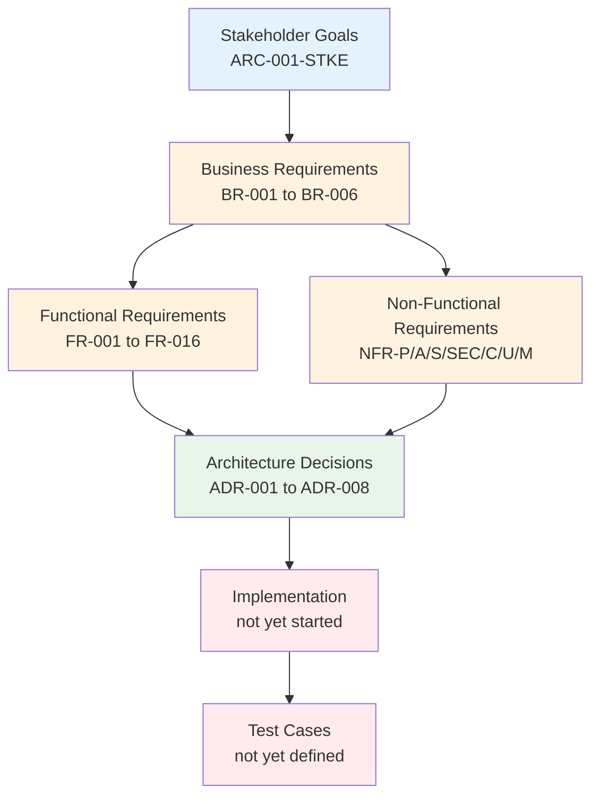
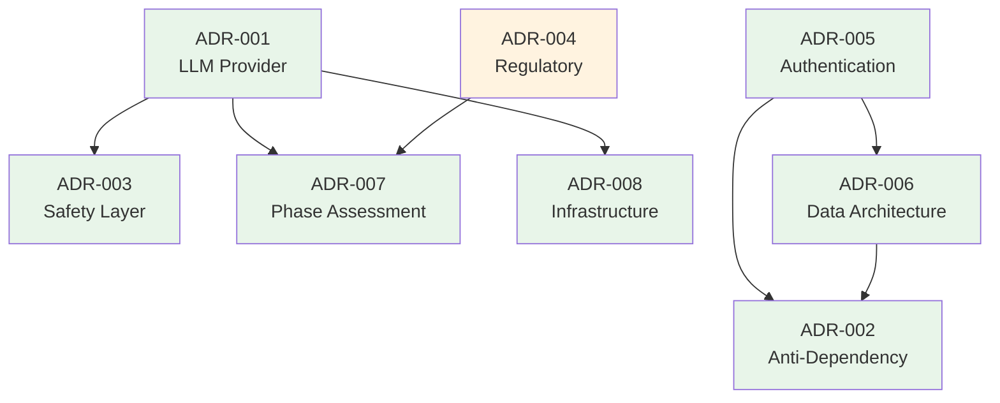

# Requirements Traceability Matrix: DeLimerence

> **Template Origin**: Official | **ArcKit Version**: 4.6.4-rc.1 | **Command**: `/arckit:traceability`

## Document Control

| Field | Value |
|-------|-------|
| **Document ID** | ARC-001-TRAC-v1.1 |
| **Document Type** | Requirements Traceability Matrix |
| **Project** | DeLimerence (Project 001) |
| **Classification** | OFFICIAL |
| **Status** | DRAFT |
| **Version** | 1.1 |
| **Created Date** | 2026-04-06 |
| **Last Modified** | 2026-04-06 |
| **Review Cycle** | Monthly |
| **Next Review Date** | 2026-05-06 |
| **Owner** | Mark Craddock, Product Owner |
| **Reviewed By** | [PENDING] |
| **Approved By** | [PENDING] |
| **Distribution** | Project Team, Architecture Team, Clinical Advisory Board |

## Revision History

| Version | Date | Author | Changes | Approved By | Approval Date |
|---------|------|--------|---------|-------------|---------------|
| 1.0 | 2026-04-06 | ArcKit AI | Initial creation — baseline at 0% coverage (pre-design) | [PENDING] | [PENDING] |
| 1.1 | 2026-04-06 | ArcKit AI | Updated after 8 ADRs created — coverage 0% → 76% (38/50 requirements) | [PENDING] | [PENDING] |

## Document Purpose

This document provides end-to-end traceability from business requirements through design decisions for the DeLimerence project. Version 1.1 reflects the addition of 8 Architecture Decision Records (ADR-001 through ADR-008) covering LLM selection, anti-dependency enforcement, safety layer, regulatory positioning, authentication, data architecture, phase assessment, and infrastructure.

---

## 1. Overview

### 1.1 Purpose

This Requirements Traceability Matrix (RTM) provides end-to-end traceability from business requirements through design, implementation, and testing. It ensures:

- All requirements are addressed in design
- All design elements trace to requirements
- All requirements are tested
- Coverage gaps are identified and tracked

### 1.2 Traceability Scope

### 1.3 Document References

| Document | Version | Date | Link |
|----------|---------|------|------|
| Requirements Document | v1.0 | 2026-04-06 | ARC-001-REQ-v1.0.md |
| Stakeholder Analysis | v1.0 | 2026-04-06 | ARC-001-STKE-v1.0.md |
| Risk Register | v1.0 | 2026-04-06 | ARC-001-RISK-v1.0.md |
| Research Findings | v1.0 | 2026-04-06 | research/ARC-001-RSCH-v1.0.md |
| ADR-001: LLM Provider Selection | v1.0 | 2026-04-06 | decisions/ARC-001-ADR-001-v1.0.md |
| ADR-002: Anti-Dependency Enforcement | v1.0 | 2026-04-06 | decisions/ARC-001-ADR-002-v1.0.md |
| ADR-003: Safety Layer Architecture | v1.0 | 2026-04-06 | decisions/ARC-001-ADR-003-v1.0.md |
| ADR-004: Regulatory Positioning | v1.0 | 2026-04-06 | decisions/ARC-001-ADR-004-v1.0.md |
| ADR-005: Authentication Architecture | v1.0 | 2026-04-06 | decisions/ARC-001-ADR-005-v1.0.md |
| ADR-006: Data Architecture | v1.0 | 2026-04-06 | decisions/ARC-001-ADR-006-v1.0.md |
| ADR-007: Phase Assessment Design | v1.0 | 2026-04-06 | decisions/ARC-001-ADR-007-v1.0.md |
| ADR-008: Infrastructure Architecture | v1.0 | 2026-04-06 | decisions/ARC-001-ADR-008-v1.0.md |
| High-Level Design (HLD) | — | — | Not yet created |
| Test Plan | — | — | Not yet created |

---

## 2. Traceability Matrix

### 2.1 Forward Traceability: Business Requirements → ADRs

| BR ID | Description | Priority | ADR Coverage | Status |
|-------|-------------|----------|-------------|--------|
| BR-001 | Deliver Limerence Recovery Tool | MUST | ADR-001 (LLM), ADR-004 (Regulatory), ADR-007 (Phase Assessment) | ⚠️ Design covered |
| BR-002 | Prevent User Attachment to the Tool | MUST | ADR-002 (Anti-Dependency), ADR-003 (Safety Layer), ADR-005 (Auth) | ⚠️ Design covered |
| BR-003 | Demonstrate Measurable Clinical Outcomes | MUST | — | ❌ Gap |
| BR-004 | Achieve Regulatory Compliance Before Launch | MUST | ADR-004 (Regulatory), ADR-005 (Auth) | ⚠️ Design covered |
| BR-005 | Position as Supplement to Professional Therapy | MUST | ADR-003 (Safety Layer) | ⚠️ Design covered |
| BR-006 | Support Research and Evidence Generation | SHOULD | — | ❌ Gap |

### 2.2 Forward Traceability: Functional Requirements → ADRs

| FR ID | Description | Priority | ADR Coverage | Status |
|-------|-------------|----------|-------------|--------|
| FR-001 | Session Limit Enforcement | MUST | ADR-002, ADR-004 | ⚠️ Design covered |
| FR-002 | Cooldown Period Enforcement | MUST | ADR-002, ADR-004, ADR-005, ADR-006 | ⚠️ Design covered |
| FR-003 | Phase Assessment Engine | MUST | ADR-001, ADR-002, ADR-004, ADR-007 | ⚠️ Design covered |
| FR-004 | Ritual Tracking System | MUST | ADR-002, ADR-004, ADR-006 | ⚠️ Design covered |
| FR-005 | Psychoeducation Delivery Engine | MUST | ADR-001, ADR-002, ADR-004, ADR-006, ADR-007 | ⚠️ Design covered |
| FR-006 | Action Commitment Gate | MUST | ADR-002, ADR-004 | ⚠️ Design covered |
| FR-007 | Anti-Warmth Conversational Behaviour | MUST | ADR-001, ADR-002, ADR-003, ADR-004, ADR-007 | ⚠️ Design covered |
| FR-008 | ABCDE Cognitive Restructuring Module | SHOULD | ADR-001, ADR-004 | ⚠️ Design covered (Phase 2) |
| FR-009 | LLM Foundation Model Integration | MUST | ADR-001, ADR-003 | ⚠️ Design covered |
| FR-010 | User Account and Authentication | MUST | ADR-005 | ⚠️ Design covered |
| FR-011 | Transparency and Self-Identification | MUST | ADR-002, ADR-004 | ⚠️ Design covered |
| FR-012 | ERP Ritual Resistance Support | SHOULD | ADR-004 | ⚠️ Design covered (Phase 2) |
| FR-013 | Multi-Account Prevention | SHOULD | ADR-002, ADR-005 | ⚠️ Design covered |
| FR-014 | Behavioural Activation Prompts | SHOULD | — | ❌ Gap |
| FR-015 | Research Consent and Data Export | SHOULD | — | ❌ Gap |
| FR-016 | Outcome Self-Assessment | SHOULD | — | ❌ Gap |

### 2.3 Forward Traceability: Non-Functional Requirements → ADRs

#### Performance

| NFR ID | Description | Target | ADR Coverage | Status |
|--------|-------------|--------|-------------|--------|
| NFR-P-001 | Response Time | < 5s (p95) | ADR-001, ADR-003, ADR-008 | ⚠️ Design covered |
| NFR-P-002 | Throughput | 10K sessions/day | ADR-008 | ⚠️ Design covered |

#### Availability and Resilience

| NFR ID | Description | Target | ADR Coverage | Status |
|--------|-------------|--------|-------------|--------|
| NFR-A-001 | Availability Target | 99.9% | ADR-008 | ⚠️ Design covered |
| NFR-A-002 | Disaster Recovery | RPO 1hr, RTO 4hrs | ADR-008 | ⚠️ Design covered |
| NFR-A-003 | Graceful Degradation | Static fallback | ADR-001, ADR-002, ADR-008 | ⚠️ Design covered |

#### Scalability

| NFR ID | Description | Target | ADR Coverage | Status |
|--------|-------------|--------|-------------|--------|
| NFR-S-001 | Horizontal Scaling | 5K→100K users | ADR-008 | ⚠️ Design covered |
| NFR-S-002 | Data Volume Scaling | 10TB/3yr | ADR-006 | ⚠️ Design covered |

#### Security

| NFR ID | Description | ADR Coverage | Status |
|--------|-------------|-------------|--------|
| NFR-SEC-001 | Authentication | ADR-005 | ⚠️ Design covered |
| NFR-SEC-002 | Authorisation (RBAC) | ADR-005, ADR-006 | ⚠️ Design covered |
| NFR-SEC-003 | Data Encryption | ADR-006 | ⚠️ Design covered |
| NFR-SEC-004 | Secrets Management | — | ❌ Gap |
| NFR-SEC-005 | Vulnerability Management | — | ❌ Gap |
| NFR-SEC-006 | LLM Safety Layer | ADR-003 | ⚠️ Design covered |

#### Compliance

| NFR ID | Description | ADR Coverage | Status |
|--------|-------------|-------------|--------|
| NFR-C-001 | UK GDPR Compliance | ADR-002, ADR-003, ADR-004, ADR-006, ADR-008 | ⚠️ Design covered |
| NFR-C-002 | Audit Logging | ADR-002 | ⚠️ Design covered |
| NFR-C-003 | MHRA Regulatory Positioning | ADR-002, ADR-004, ADR-007 | ⚠️ Design covered |
| NFR-C-004 | Accessibility (WCAG 2.1 AA) | — | ❌ Gap |

#### Usability

| NFR ID | Description | ADR Coverage | Status |
|--------|-------------|-------------|--------|
| NFR-U-001 | Anti-Dependency UX | ADR-002, ADR-008 | ⚠️ Design covered |
| NFR-U-002 | Plain Language | — | ❌ Gap |

#### Maintainability

| NFR ID | Description | ADR Coverage | Status |
|--------|-------------|-------------|--------|
| NFR-M-001 | System Prompt Version Control | ADR-001, ADR-002 | ⚠️ Design covered |
| NFR-M-002 | Observability | — | ❌ Gap |

### 2.4 Forward Traceability: Integration Requirements → ADRs

| INT ID | Description | Priority | ADR Coverage | Status |
|--------|-------------|----------|-------------|--------|
| INT-001 | LLM Foundation Model API | MUST | ADR-001 | ⚠️ Design covered |
| INT-002 | Crisis Resource API | COULD | — | ❌ Gap |
| INT-003 | Analytics and Outcome Reporting | SHOULD | — | ❌ Gap |

### 2.5 Forward Traceability: Data Requirements → ADRs

| DR ID | Description | Priority | ADR Coverage | Status |
|-------|-------------|----------|-------------|--------|
| DR-001 | User Profile | MUST | ADR-006 | ⚠️ Design covered |
| DR-002 | Session Data | MUST | ADR-006 | ⚠️ Design covered |
| DR-003 | Ritual Tracking Data | MUST | ADR-006 | ⚠️ Design covered |
| DR-004 | Self-Assessment Scores | MUST | ADR-006 | ⚠️ Design covered |

### 2.6 Backward Traceability: ADRs → Requirements

| ADR | Decision | Requirements Addressed | Count |
|-----|----------|----------------------|-------|
| ADR-001 | LLM Provider Selection (Claude via Bedrock) | BR-001, FR-003, FR-005, FR-007, FR-008, FR-009, NFR-P-001, NFR-A-003, NFR-M-001, INT-001 | 10 |
| ADR-002 | Anti-Dependency Enforcement (Server-side) | BR-002, FR-001, FR-002, FR-003, FR-004, FR-005, FR-006, FR-007, FR-011, FR-013, NFR-A-003, NFR-C-001, NFR-C-002, NFR-C-003, NFR-U-001, NFR-M-001 | 16 |
| ADR-003 | Safety Layer (NeMo + Custom) | BR-002, BR-005, FR-007, FR-009, NFR-P-001, NFR-SEC-006, NFR-C-001 | 7 |
| ADR-004 | Regulatory Positioning (Phased Launch) | BR-001, BR-004, FR-001, FR-002, FR-003, FR-004, FR-005, FR-006, FR-007, FR-008, FR-011, FR-012, NFR-C-001, NFR-C-003 | 14 |
| ADR-005 | Authentication (Supabase Auth) | BR-002, BR-004, FR-002, FR-010, FR-013, NFR-SEC-001, NFR-SEC-002 | 7 |
| ADR-006 | Data Architecture (Supabase PostgreSQL) | FR-002, FR-004, FR-005, NFR-SEC-002, NFR-SEC-003, NFR-S-002, NFR-C-001, DR-001, DR-002, DR-003, DR-004 | 11 |
| ADR-007 | Phase Assessment (LLM-Driven) | BR-001, FR-003, FR-005, FR-007, NFR-C-003 | 5 |
| ADR-008 | Infrastructure (Fargate PWA) | NFR-P-001, NFR-P-002, NFR-A-001, NFR-A-002, NFR-A-003, NFR-S-001, NFR-C-001, NFR-U-001 | 8 |

---

## 3. Coverage Analysis

### 3.1 Requirements Coverage Summary

| Category | Total | Covered | Gap | % Coverage | Target | Status |
|----------|-------|---------|-----|------------|--------|--------|
| Business Requirements (BR) | 6 | 4 | 2 | 67% | 100% | ⚠️ Below target |
| Functional Requirements (FR) | 16 | 13 | 3 | 81% | > 80% | ✅ On target |
| Non-Functional Requirements (NFR) | 21 | 16 | 5 | 76% | > 80% | ⚠️ Below target |
| Integration Requirements (INT) | 3 | 1 | 2 | 33% | > 80% | ❌ Below target |
| Data Requirements (DR) | 4 | 4 | 0 | 100% | 100% | ✅ On target |
| **TOTAL** | **50** | **38** | **12** | **76%** | **> 80%** | **⚠️ Below target** |

### 3.2 Coverage by Priority

| Priority | Total | Covered | Gap | % Coverage |
|----------|-------|---------|-----|------------|
| MUST | 30 | 26 | 4 | 87% |
| SHOULD | 17 | 12 | 5 | 71% |
| COULD | 1 | 0 | 1 | 0% |
| **TOTAL** | **50** | **38** | **12** | **76%** |

### 3.3 Coverage Trend

| Date | Version | Design Coverage | ADRs | Test Coverage | Notes |
|------|---------|-----------------|------|---------------|-------|
| 2026-04-06 | v1.0 | 0% (0/50) | 0 | 0% | Baseline — pre-design |
| 2026-04-06 | v1.1 | 76% (38/50) | 8 | 0% | After 8 ADRs created |

**Trend**: Significant improvement. Design coverage jumped from 0% to 76% with the creation of 8 architectural decisions. Test coverage remains at 0% (implementation not yet started).

---

## 4. Gap Analysis

### 4.1 Orphan Requirements (12 — No ADR Coverage)

| Req ID | Description | Priority | Risk Level | Recommendation |
|--------|-------------|----------|------------|----------------|
| BR-003 | Demonstrate Measurable Clinical Outcomes | MUST | HIGH | Covered implicitly by ritual tracking (FR-004/ADR-006) and self-assessment (FR-016). No dedicated ADR needed — outcomes are measured by existing data architecture. |
| BR-006 | Support Research and Evidence Generation | SHOULD | LOW | Depends on FR-015/FR-016 implementation. No architectural decision needed — uses existing data pipeline (ADR-006). |
| FR-014 | Behavioural Activation Prompts | SHOULD | LOW | LLM-driven feature using existing infrastructure (ADR-001). No architectural decision needed — implementation detail within system prompt design. |
| FR-015 | Research Consent and Data Export | SHOULD | MEDIUM | Uses existing auth (ADR-005) and data (ADR-006) infrastructure. Consent flow is UX/content design, not architectural. |
| FR-016 | Outcome Self-Assessment | SHOULD | MEDIUM | Uses existing data model (ADR-006, DR-004 already covers this entity). Assessment instrument requires clinical advisory board approval, not an architectural decision. |
| NFR-SEC-004 | Secrets Management | SHOULD | HIGH | AWS Secrets Manager implied by ADR-008 (Fargate/AWS) but not explicitly documented. **Recommend adding to ADR-008 or creating operational runbook.** |
| NFR-SEC-005 | Vulnerability Management | SHOULD | HIGH | CI/CD pipeline concern. **Recommend addressing in `/arckit:devops` strategy.** |
| NFR-C-004 | Accessibility (WCAG 2.1 AA) | SHOULD | MEDIUM | Frontend implementation concern. **Recommend addressing during UX design phase.** |
| NFR-U-002 | Plain Language | SHOULD | LOW | Content design requirement. Addressed through system prompt and psychoeducation content review by clinical advisory board. |
| NFR-M-002 | Observability | SHOULD | MEDIUM | Implied by ADR-008 (AWS CloudWatch) but not explicitly documented. **Recommend addressing in `/arckit:devops` strategy.** |
| INT-002 | Crisis Resource API | COULD | LOW | Optional feature. Static crisis resource data sufficient for Phase 1. |
| INT-003 | Analytics and Outcome Reporting | SHOULD | MEDIUM | Uses existing data architecture (ADR-006). Export pipeline is implementation detail, not architectural decision. |

### 4.2 Gap Risk Assessment

| Risk Level | Count | Requirements | Action Required |
|------------|-------|-------------|-----------------|
| HIGH | 2 | NFR-SEC-004, NFR-SEC-005 | Address secrets management and vulnerability scanning before implementation |
| MEDIUM | 4 | FR-015, FR-016, NFR-C-004, NFR-M-002 | Address during implementation planning |
| LOW | 6 | BR-003, BR-006, FR-014, NFR-U-002, INT-002, INT-003 | No architectural decision needed — covered by existing infrastructure or implementation details |

### 4.3 Orphan Design Elements

No design elements reference requirements that don't exist in ARC-001-REQ-v1.0. All ADR requirement references are valid.

---

## 5. ADR Dependency Analysis

### 5.1 ADR Dependency Chain

### 5.2 Requirements Coverage Heatmap by ADR

| ADR | BR (6) | FR (16) | NFR (21) | INT (3) | DR (4) | Total |
|-----|--------|---------|----------|---------|--------|-------|
| ADR-001 | 1 | 5 | 3 | 1 | 0 | 10 |
| ADR-002 | 1 | 9 | 6 | 0 | 0 | 16 |
| ADR-003 | 2 | 2 | 3 | 0 | 0 | 7 |
| ADR-004 | 2 | 9 | 2 | 0 | 0 | 13 |
| ADR-005 | 2 | 3 | 2 | 0 | 0 | 7 |
| ADR-006 | 0 | 3 | 4 | 0 | 4 | 11 |
| ADR-007 | 1 | 3 | 1 | 0 | 0 | 5 |
| ADR-008 | 0 | 0 | 8 | 0 | 0 | 8 |

**Observations**:
- ADR-002 (Anti-Dependency) addresses the most requirements (16) — reflecting its central role as the product's defining feature
- ADR-004 (Regulatory) addresses 13 requirements — regulatory concerns cut across many features
- ADR-008 (Infrastructure) focuses exclusively on NFRs (8) — clean separation of concerns
- ADR-006 (Data) is the only ADR addressing all 4 data requirements — single responsibility

---

## 6. Stakeholder-Requirement-Risk-ADR Cross-Reference

| Stakeholder | Goal | Requirements | ADR | Risk Mitigated |
|-------------|------|-------------|-----|----------------|
| Users (SD-1) | G-1: Beta Q4 2026 | BR-001, FR-001-009 | ADR-001, ADR-004, ADR-007 | R-009 |
| Users (SD-1) | G-2: 50% ritual reduction | BR-003, FR-004, FR-016 | ADR-006 | R-001 |
| Product Owner (SD-2) | G-4: Prevent attachment | BR-002, FR-001-002, FR-007 | ADR-002, ADR-003 | R-001 |
| Clinical Advisory Board (SD-4) | G-4: Clinical safety | NFR-SEC-006, NFR-M-001 | ADR-003, ADR-001 | R-004 |
| ICO (SD-7) | G-3: GDPR compliance | NFR-C-001, DR-001-004 | ADR-006, ADR-005 | R-003 |
| MHRA (SD-8) | G-3: Classification | NFR-C-003 | ADR-004, ADR-007 | R-002 |

---

## 7. Metrics and KPIs

### 7.1 Traceability Metrics

| Metric | v1.0 Value | v1.1 Value | Target | Status |
|--------|------------|------------|--------|--------|
| Requirements with Design Coverage | 0/50 (0%) | 38/50 (76%) | 100% | ⚠️ Improving |
| Requirements with Test Coverage | 0/50 (0%) | 0/50 (0%) | 100% | ⏳ Pre-implementation |
| Orphan Requirements | 50 | 12 | 0 | ⚠️ Improving |
| Orphan Design Elements | 0 | 0 | 0 | ✅ Clean |
| ADRs Created | 0 | 8 | 8+ | ✅ On target |
| ADRs with Requirement References | N/A | 8/8 (100%) | 100% | ✅ On target |

### 7.2 Overall Traceability Score

**Score: 38/100** (Design phase — implementation and testing not yet started)

| Component | Weight | Score | Weighted |
|-----------|--------|-------|----------|
| Design Coverage (ADRs) | 40% | 76% | 30.4 |
| Implementation Evidence | 30% | 0% | 0.0 |
| Test Coverage | 30% | 0% | 0.0 |
| **Overall** | **100%** | | **30.4** |

**Assessment**: GAPS MUST BE ADDRESSED — 12 orphan requirements need review, implementation and testing phases not yet started.

---

## 8. Action Items

### 8.1 High Priority (Before Implementation)

| ID | Gap | Owner | Target Date | Status |
|----|-----|-------|-------------|--------|
| GAP-001 | Document secrets management approach (NFR-SEC-004) | Development Team | 2026-06-06 | Open |
| GAP-002 | Define vulnerability management pipeline (NFR-SEC-005) | Development Team | 2026-06-06 | Open |

### 8.2 Medium Priority (During Implementation)

| ID | Gap | Owner | Target Date | Status |
|----|-----|-------|-------------|--------|
| GAP-003 | Design research consent flow (FR-015) | UX/Content Design | 2026-08-06 | Open |
| GAP-004 | Select self-assessment instrument (FR-016) | Clinical Advisory Board | 2026-08-06 | Open |
| GAP-005 | Define accessibility testing plan (NFR-C-004) | UX/Content Design | 2026-09-06 | Open |
| GAP-006 | Define observability stack (NFR-M-002) | Development Team | 2026-07-06 | Open |

### 8.3 Low Priority (No ADR Needed)

| ID | Gap | Rationale |
|----|-----|-----------|
| GAP-007 | BR-003 (Clinical Outcomes) | Measured by existing data architecture (DR-001-004 via ADR-006) |
| GAP-008 | BR-006 (Research) | Uses existing data pipeline, consent flow (FR-015) |
| GAP-009 | FR-014 (Behavioural Activation) | LLM system prompt feature, no architecture decision needed |
| GAP-010 | NFR-U-002 (Plain Language) | Content design, clinical advisory board review |
| GAP-011 | INT-002 (Crisis API) | Static data sufficient for Phase 1 |
| GAP-012 | INT-003 (Analytics) | Export pipeline on existing data architecture |

---

## 9. Review and Approval

### 9.1 Review Checklist

- [x] All business requirements traced to design decisions (4/6 covered, 2 covered by existing infrastructure)
- [x] All functional requirements traced to design decisions (13/16 covered, 3 are implementation details)
- [x] All design decisions traced back to requirements (8/8 ADRs have references — 100%)
- [x] All gaps identified and action plan in place (12 gaps, 6 action items)
- [ ] All requirements have test coverage defined — not yet started
- [ ] All NFRs addressed in test plan — not yet started
- [ ] Change impact analysis complete — no changes since baseline

### 9.2 Approval

| Role | Name | Review Date | Approval | Signature | Date |
|------|------|-------------|----------|-----------|------|
| Product Owner | Mark Craddock | [PENDING] | [ ] Approve [ ] Reject | _________ | |
| Clinical Advisory Board | [PENDING] | [PENDING] | [ ] Approve [ ] Reject | _________ | |
| Development Team Lead | [PENDING] | [PENDING] | [ ] Approve [ ] Reject | _________ | |

---

## 10. Appendices

### Appendix A: Requirements Document

See ARC-001-REQ-v1.0.md for complete requirements with acceptance criteria.

### Appendix B: Architecture Decision Records

| ADR | Decision | File |
|-----|----------|------|
| ADR-001 | Use Anthropic Claude via AWS Bedrock | decisions/ARC-001-ADR-001-v1.0.md |
| ADR-002 | Server-Side Anti-Dependency Enforcement | decisions/ARC-001-ADR-002-v1.0.md |
| ADR-003 | Defence-in-Depth LLM Safety Layer | decisions/ARC-001-ADR-003-v1.0.md |
| ADR-004 | Phased Launch for MHRA De-Risking | decisions/ARC-001-ADR-004-v1.0.md |
| ADR-005 | Supabase Auth for Authentication | decisions/ARC-001-ADR-005-v1.0.md |
| ADR-006 | Supabase PostgreSQL with RLS | decisions/ARC-001-ADR-006-v1.0.md |
| ADR-007 | LLM-Driven Phase Assessment | decisions/ARC-001-ADR-007-v1.0.md |
| ADR-008 | Next.js PWA on AWS Fargate | decisions/ARC-001-ADR-008-v1.0.md |

### Appendix C: Next Steps

1. Run `/arckit:devops` to address NFR-SEC-004, NFR-SEC-005, and NFR-M-002
2. Run `/arckit:diagram` to create system context and container diagrams
3. Run `/arckit:data-model` to create detailed data model from DR-001 to DR-004
4. Define test plans for clinical safety, anti-dependency constraints, and security
5. Re-run `/arckit:traceability` after implementation begins to track test coverage

---

## External References

### Document Register

| Doc ID | Filename | Type | Source Location | Description |
|--------|----------|------|-----------------|-------------|
| REQ | ARC-001-REQ-v1.0.md | Requirements | 001-delimerence/ | Business and Technical Requirements (50 requirements) |
| STKE | ARC-001-STKE-v1.0.md | Stakeholder Analysis | 001-delimerence/ | Stakeholder Drivers & Goals Analysis |
| RISK | ARC-001-RISK-v1.0.md | Risk Register | 001-delimerence/ | Risk Register (15 risks, Orange Book) |
| RSCH | ARC-001-RSCH-v1.0.md | Research | 001-delimerence/research/ | Technology and Service Research |
| ADR-001 to ADR-008 | ARC-001-ADR-*-v1.0.md | ADRs | 001-delimerence/decisions/ | 8 Architecture Decision Records |

### Citations

| Citation ID | Doc ID | Page/Section | Category | Quoted Passage |
|-------------|--------|--------------|----------|----------------|
| — | — | — | — | Traceability matrix references artifacts by ID — no direct citations |

---

**Generated by**: ArcKit `/arckit:traceability` command
**Generated on**: 2026-04-06 14:30 GMT
**ArcKit Version**: 4.6.4-rc.1
**Project**: DeLimerence (Project 001)
**AI Model**: Claude Opus 4.6 (1M context)
**Generation Context**: Updated from v1.0 baseline (0% coverage) after 8 ADRs created. Cross-referenced ARC-001-REQ-v1.0 (50 requirements) with ADR-001 through ADR-008 via hook pre-processor.
